# Automated Material Testing System (Tinius Olsen)

Penn State Learning Factory capstone (EDSGN 460W) — an automatic specimen-identification system for Tinius Olsen universal testing machines (UTMs). It replaces manual caliper/visual measurement with a camera-based pipeline that measures a specimen's dimensions, classifies its material, and reports the applicable ASTM standard.

## Problem

Tinius Olsen operators currently identify each test specimen's shape, dimensions, material, and ASTM standard by hand — measuring with calipers and visually inspecting the sample. This process is slow, inconsistent between operators, and prone to error. The goal of this project was to build a low-operator-input system, using ML/AI where useful, that automatically determines a specimen's dimensions, shape, material, and correct ASTM standard within a $1,250 budget and a 16-week timeline, while staying safe, intuitive, and easy to extend.

## System Overview

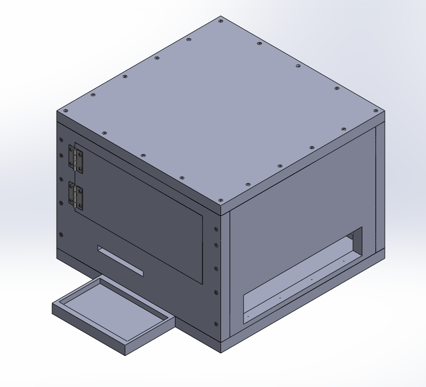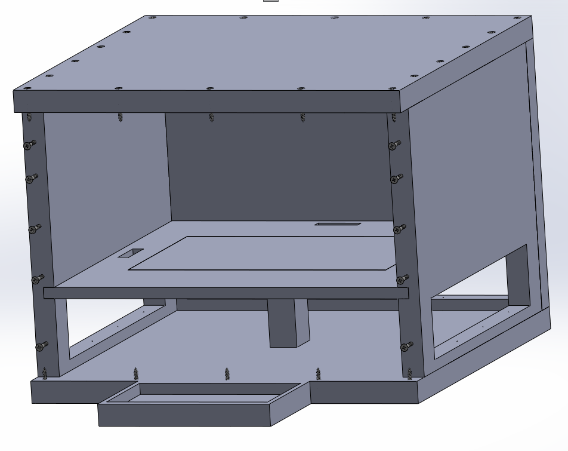

The prototype is a two-shelf plywood enclosure:

- **Upper shelf** — a removable measurement platform, a top-down USB camera and a side USB camera, LED ring lighting, and a white photo backdrop for consistent segmentation.
- **Lower shelf** — a Raspberry Pi 5 (16 GB RAM), wiring, and power, with a monitor/keyboard/mouse for the operator-facing GUI.

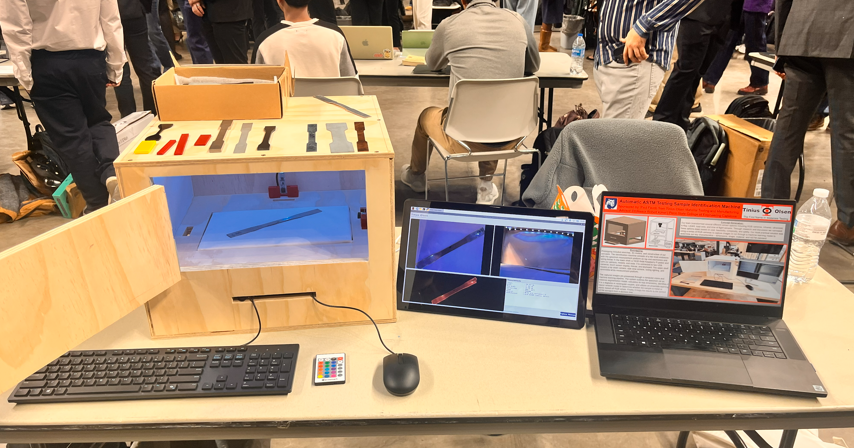

A single "Capture & Measure" button in the GUI drives the full pipeline:

1. **Capture** — grab synchronized top-down and side images.
2. **Segment** — isolate the specimen from the background to get a pixel-accurate mask/outline.
3. **Measure** — convert the mask to real-world dimensions (length, width, neck width, surface area) using a calibrated pixel-to-mm conversion, and infer shape (dogbone vs. rectangular coupon) from the width/neck ratio.
4. **Classify material** — an ensemble of a small CNN votes on texture/color patches sampled from the specimen to call it plastic or metal, with a confidence score.
5. **Decide ASTM standard** — a deterministic decision engine maps shape + material (+ cross-section, for metals) to the correct standard.

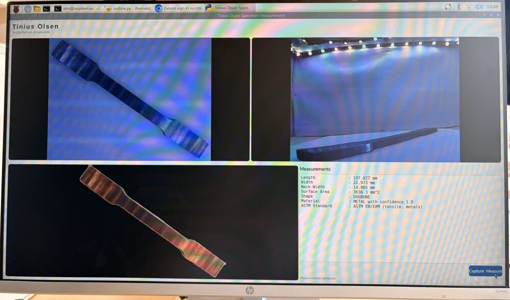
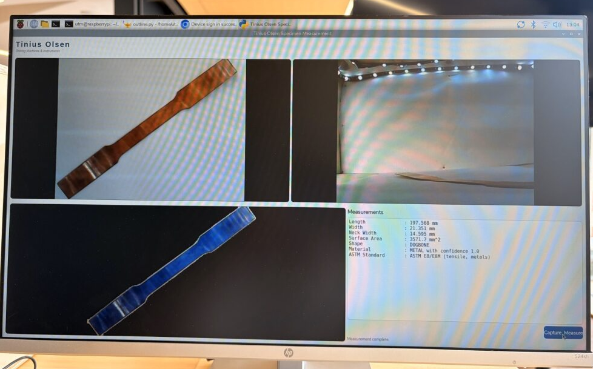

*Example result: a metal dogbone specimen measured at 197.6 mm × 21.4 mm (14.6 mm neck), classified as METAL with confidence 1.0, mapped to ASTM E8/E8M.*

## Material Classification

Rather than classifying the whole image, the classifier works on small 16×16 RGB patches sampled from inside the segmented specimen (patch centers are constrained by a distance transform so they stay away from the mask edge). A compact CNN — three conv blocks (batchnorm + ReLU) with 2×2 max-pooling, a 512-feature flatten, dropout, and two fully-connected layers — scores each patch as plastic or metal. About 100 patches are sampled per specimen and combined by majority vote, with the vote fraction reported as a confidence score.

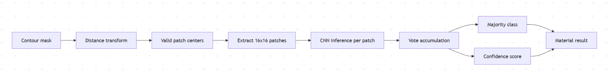

Training used flips/brightness/contrast jitter/Gaussian-noise augmentation, `WeightedRandomSampler` to correct for class imbalance, Adam with L2 weight decay and dropout for regularization, a cosine-annealing LR schedule, and early stopping on validation accuracy.

## ASTM Decision Logic

The decision engine is a deterministic function of measured shape and inferred material:

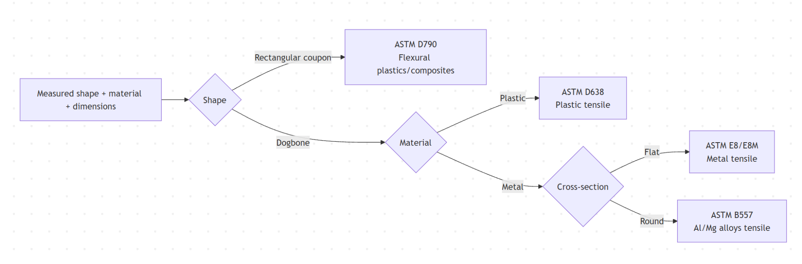

- Rectangular coupon → **ASTM D790** (plastics, flexural)
- Dogbone + plastic → **ASTM D638** (plastics, tensile)
- Dogbone + metal → **ASTM E8/E8M** (metals, tensile), extensible to **ASTM B557** (Al/Mg alloys) by cross-section

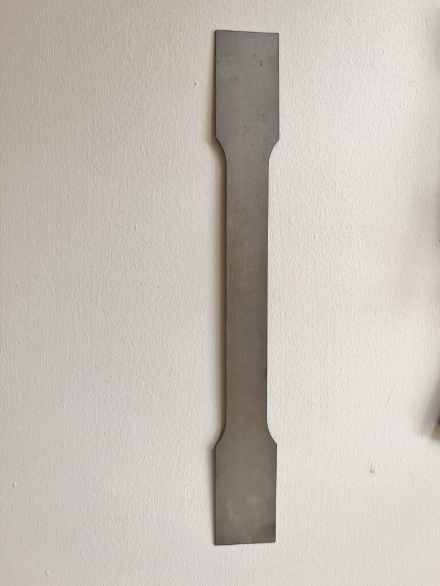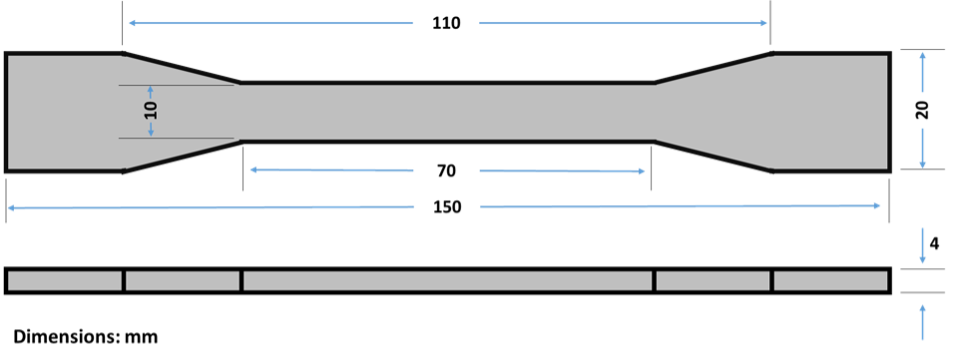

## Results

On the test specimens evaluated, automatically measured dimensions never differed from manual measurements by more than ~4 mm, and shape/material/ASTM-standard classification was correct in every trial. Rectangular coupon samples were 3D-printed to exact target dimensions, since matching real coupon stock wasn't available for validation.

## Development History

- **Concept generation** compared RGB cameras, LiDAR/ToF, IR/UV imaging, X-ray, and strain-gauge load cells for sensing; RGB cameras were chosen for being versatile, cheap, and easy to integrate, and a load cell was considered as a secondary density-based material signal.

  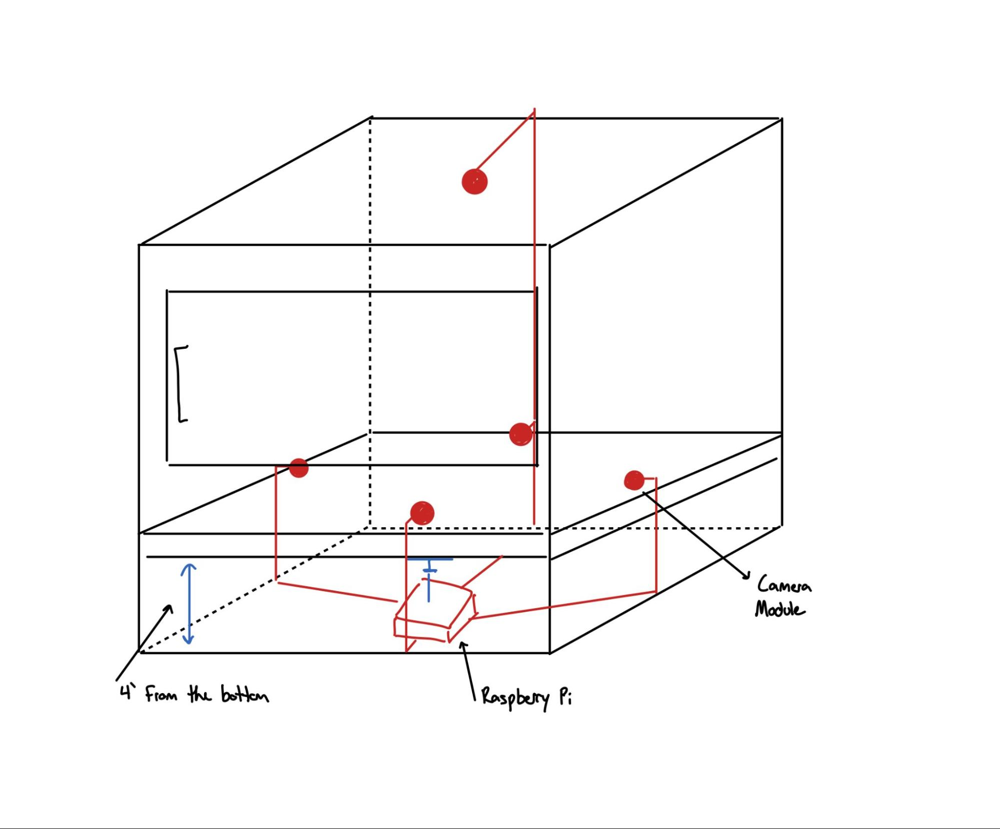

- **Beta 1 prototype** was a laser-cut acrylic box with a single top-down camera and a Raspberry Pi 5. It validated the ~8" camera standoff distance and controlled lighting, but the acrylic proved too weak and transparent, leading to a switch to plywood.

  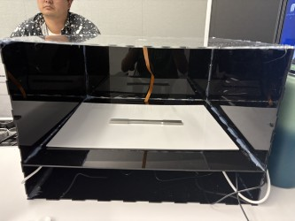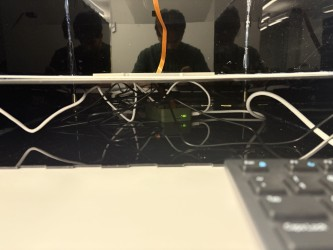

- **Hardware/sensor research** confirmed RGB cameras as the best fit (LiDAR/ToF lacked resolution and was light-sensitive, IR/UV lacked accuracy, X-ray was too costly/unsafe), selected HX711-based load cells for future material sub-classification, and upgraded to a 16 GB Raspberry Pi 5 for the added compute headroom of the segmentation and classification models.
- **Alpha 1 (final) prototype** is the plywood two-shelf enclosure described above, with the full capture → segment → measure → classify → decide pipeline wired into a single-button GUI.
- **Challenges:** the Raspberry Pi camera modules failed repeatedly across multiple camera/cable/Pi/OS swaps, forcing a fallback to a lower-quality top-down USB camera; the Pi's 7" touchscreen never worked despite correct wiring and configuration; and the original load cell was defective (pinned at max reading), with replacements arriving too late to integrate into the final prototype.

## Software Pipeline

- **GUI** (`tinius_gui.py`) — PyQt5 + OpenCV, showing both live camera feeds and running measurement in a background thread so the UI doesn't freeze.
- **Segmentation & measurement** (`outline.py`) — background removal via [`rembg`](https://github.com/danielgatis/rembg) with a luminance-based fallback, morphological cleanup, and a "median contour" method to get a representative outline; computes length, max width, neck width, and surface area, and infers shape from the width/neck ratio.
- **Classifier training** (`train_model.py`, `create_dataset.py`) — `create_dataset.py` segments reference images and samples labeled 16×16 patches into `dataset/`; `train_model.py` trains the `MaterialPatchNet` CNN on those patches.
- **Ensemble inference & ASTM lookup** — implemented directly inside `outline.py` (`classify_material_from_patches`, `astm_standard`), not a separate module.
- **Model checkpoints** (`models/`) — trained CNN weights, loaded by `outline.py`.
- **Dev HTTP API** (`server/server.py`) — an independent FastAPI service exposing the same measurement pipeline over HTTP; not used by the GUI and not wired to the material classifier.

For the full per-file breakdown (including older/experimental scripts kept for reference), see [docs/CODEBASE.md](docs/CODEBASE.md).

## Repo Layout

```
tinius_gui.py             GUI entry point (PyQt5 + OpenCV) — run this on the Pi
outline.py                 Active segmentation + measurement + classification pipeline
create_dataset.py          Builds the patch-classification training dataset
train_model.py             Trains the material-classification CNN
server/                    Standalone dev FastAPI HTTP wrapper around the measurement pipeline
models/                    Trained model checkpoints
dataset/                   Patch-classification training data (.npz)
captures/, outputs/        Runtime camera captures and pipeline outputs
images/                    Reference specimen photos used in development/training
samples/                   Loose sample/test images not tied to a specific script
assets/                    Misc project assets (e.g. icon)
deploy/                    Raspberry Pi deployment config (boot config.txt)
archive/                   Superseded/experimental scripts and old log dumps, kept for reference
docs/                      Report figures and full codebase documentation
```

## Future Work

- Use the side camera (and potentially additional cameras) to capture thickness/volume and cross-check dimensions from multiple angles.
- Integrate a working load cell for density-based material sub-classification beyond the current binary plastic/metal split.
- Extend the classifier and decision engine to more specimen shapes, materials, and ASTM standards.
- General productionization: a more refined enclosure, better cable management, code cleanup, and upgraded camera/lighting hardware.

---

*This README summarizes the full capstone report. See the original report for the complete methodology, bibliography, and additional GUI output examples.*
